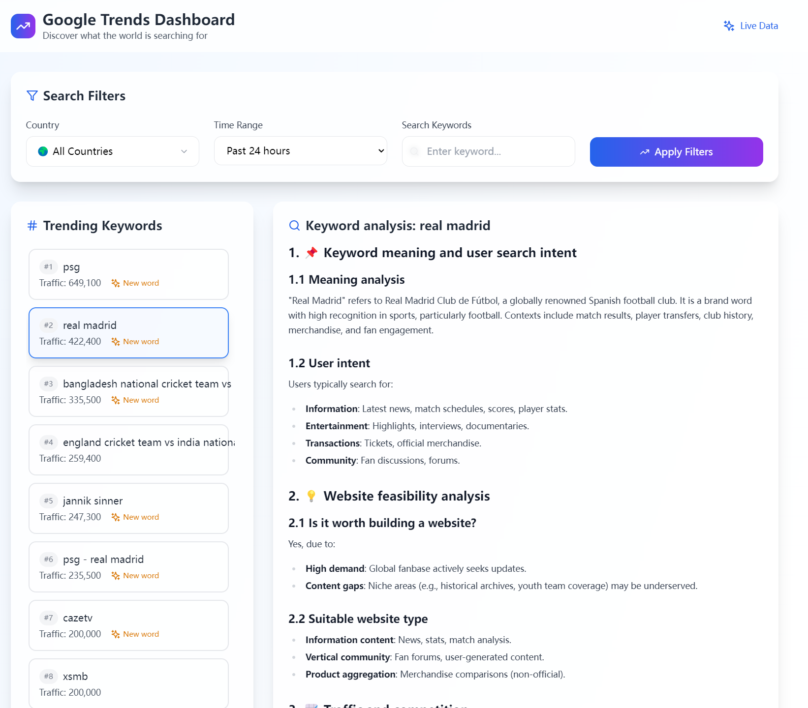
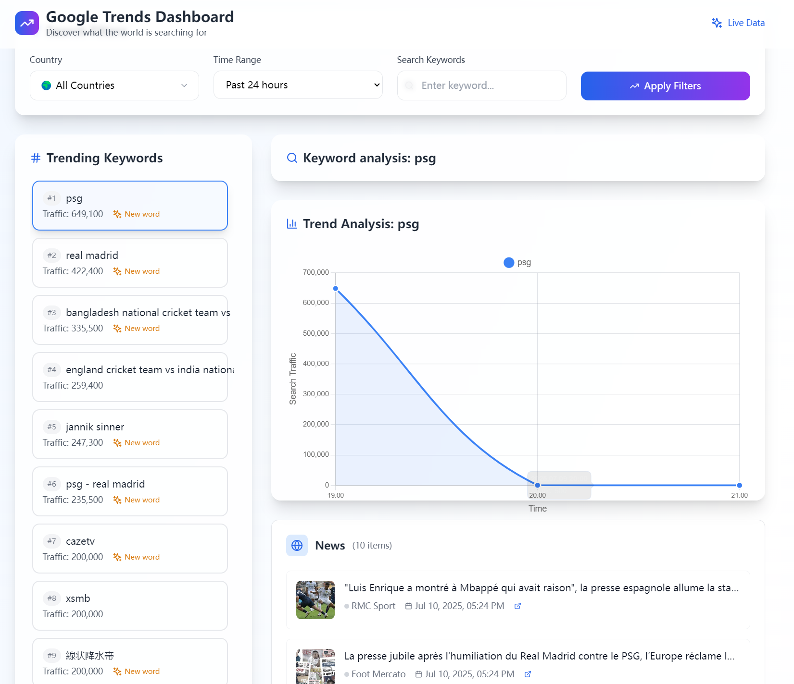

# Google-Trends-Tool-Ai(google trends dashboard)

Visit [keywordtrendsai.com](http://keywordtrendsai.com)  

An AI-powered keyword trends analytics platform based on Google Trends, designed for content creators, marketers, and researchers.

## 🔍 Key Features

- **Real-Time Trend Monitoring**  
  Explore top search keywords globally or by specific country/region. Supports multiple time ranges: 1 hour, 6 hours, 24 hours, 7 days, and 30 days.

- **Dynamic Keyword Trend Graphs**  
  Click on any trending keyword to view a traffic-over-time chart and understand its popularity evolution.

- **Traffic Estimation & New Keyword Detection**  
  Provides estimated traffic volumes for each keyword and highlights newly trending terms (labeled as "New word").

- **AI-Powered Keyword Analysis**  
  Uses AI to analyze keyword search intent and suggest related keywords, helping you enhance SEO strategies and content planning.

- **News Aggregation**  
  Displays relevant news articles for trending keywords, providing context and background information.

- **Explosive Trend Detection**  
  Highlights keywords with rapid short-term growth, helping you discover breakout topics early.

## 💡 Use Cases

- **Content Planning**: Discover trending topics and identify high-potential keywords.  
- **SEO Optimization**: Track keyword performance and uncover related term opportunities.  
- **Data Monitoring**: Stay updated on real-time keyword trends and react swiftly.  
- **Research & Analysis**: Study long-term and short-term trends across industries or topics.

## 🚀 How to Use

1. Visit [keywordtrendsai.com](http://keywordtrendsai.com)  
2. Choose your preferred region and time range  
3. Browse the trending keyword list and click to view trend graphs  
4. Use AI insights to optimize your content or marketing strategy  
5. View related news for contextual understanding

---

Start exploring keyword intelligence at [keywordtrendsai.com](http://keywordtrendsai.com)!
